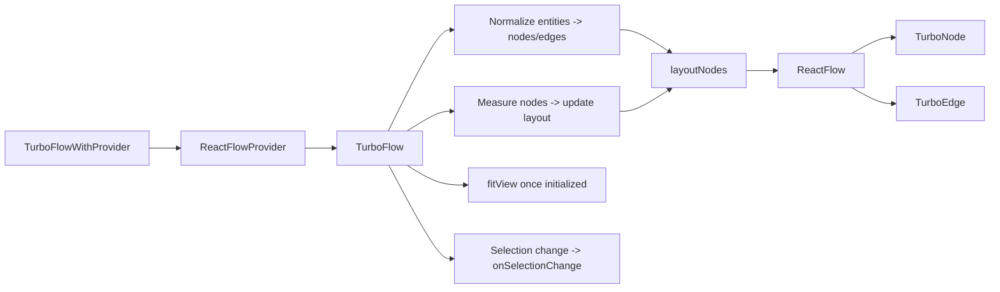

# OpenSPG Schema Highlighter Front-End

Vite + React UI for the OpenSPG schema mark language highlighter used by the IntelliJ IDEA plugin.

## Requirements

- Node.js 18+
- npm

## Quick Start

```bash
npm install
npm run dev
```

The app starts on the Vite dev server and serves from `index.html`.

## Scripts

- `npm run dev` start local dev server
- `npm run build` build production assets into `dist/`
- `npm run clean` remove the `dist/` folder
- `npm run eslint` run ESLint on `src/**/*.{ts,tsx}`
- `npm run eslint:fix` auto-fix lintable issues
- `npm run prettier` check formatting
- `npm run prettier:fix` write formatting changes
- `npm run msw:init` regenerate `public/mockServiceWorker.js`
- `npm run deploy` copy `dist/` into the IDEA plugin static resources directory

## Project Structure

```
.
├── src/                # application source (components, pages, hooks, routers, utils, styles)
├── public/             # static assets copied to the build
├── mocks/              # MSW handlers and mock data
├── dist/               # production build output (generated)
├── index.html          # app entry
├── vite.config.mts     # Vite config
└── tsconfig.json       # TypeScript config
```

## TurboFlow Component Flow



## Deployment

`npm run deploy` expects the IDEA plugin repo at `../openspg-schema-highlighter-idea-plugin` and copies
`dist/` to `../openspg-schema-highlighter-idea-plugin/src/main/resources/static`. Update `TARGET` in
`package.json` if your plugin path differs.

## Notes

- Formatting uses Prettier and ESLint.
- Code style follows 4-space indentation, single quotes, and no semicolons.

## License

[Apache-2.0](./LICENSE)
